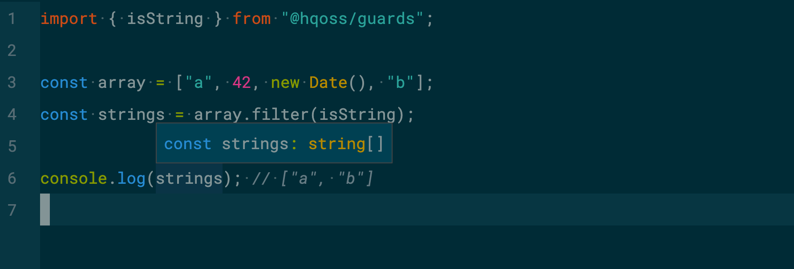

<p align="center">
  <a href="https://sniptt.com">
    
  </a>
</p>

<p align="right">
  <i>If you use this repo, star it ✨</i>
</p>

***

<p align="center">👻 <b>Comprehensive collection of type guards for JavaScript and TypeScript</b></p>

<p align="center">
  Inspired by <a href="https://hexdocs.pm/elixir/guards.html" target="_blank">Elixir guards</a>
</p>

***

<!--  -->

## Install

### Node.js and the browser

```sh
npm install @sniptt/guards
```

### Deno

```typescript
import { ... } from 'https://deno.land/x/guards/mod.ts'

// TODO
```

## Usage

### Foreword on JavaScript data types and data structures

The latest ECMAScript standard defines nine types:

*   Six **Data Types** that are primitives, checked by `typeof` operator:
    *   `undefined`: `typeof instance === "undefined"`
    *   `Boolean`: `typeof instance === "boolean"`
    *   `Number`: `typeof instance === "number"`
    *   `String`: `typeof instance === "string"`
    *   `BigInt`: `typeof instance === "bigint"`
    *   `Symbol`: `typeof instance === "symbol"`
*   **Structural Types**:
    *   `Object`: `typeof instance === "object"`. Special non-data but structural type for any constructed object instance also used as data structures: new `Object`, new `Array`, new `Map`, new `Set`, new `WeakMap`, new `WeakSet`, new `Date` and almost everything made with `new` keyword;
    *   `Function` non data structure, though it also answers for `typeof` operator: `typeof instance === "function"`. This answer is done as a special shorthand for `Function`s, though every `Function` constructor is derived from `Object` constructor.
*   **Structural Root** Primitive
    *   `null`: `typeof instance === "object"`. Special primitive type having additional usage for it's value: if object is not inherited, then `null` is shown;

Source: <https://developer.mozilla.org/en-US/docs/Web/JavaScript/Data_structures>

### Primitives

Sample usage:

```typescript
import { primitives } from '@sniptt/guards';

primitives.isNumber(val);
```

or

```typescript
import { isNumber } from '@sniptt/guards/primitives';

isNumber(val);
```

#### `isBigInt`

```typescript
import { isBigInt } from '@sniptt/guards/primitives';

let val: bigint | number;

if (isBigInt(val)) {
  // TypeScript will infer val: bigint
} else {
  // TypeScript will infer val: number
}
```

#### `isBoolean`

```typescript
import { isBoolean } from '@sniptt/guards/primitives';

let val: boolean | number;

if (isBoolean(val)) {
  // TypeScript will infer val: boolean
} else {
  // TypeScript will infer val: number
}
```

#### `isNumber`

Answers `false` to `NaN`!

See also:

*   [isNumberOrNaN](#isnumberornan)
*   [isInteger](#isinteger)
*   [isBigInt](#isbigint)

```typescript
import { isNumber } from '@sniptt/guards/primitives';

let val: number | string;

if (isNumber(val)) {
  // TypeScript will infer val: number
} else {
  // TypeScript will infer val: string
}
```

#### `isString`

```typescript
import { isString } from '@sniptt/guards/primitives';

let val: string | number;

if (isString(val)) {
  // TypeScript will infer val: string
} else {
  // TypeScript will infer val: number
}
```

#### `isSymbol`

```typescript
import { isSymbol } from '@sniptt/guards/primitives';

let val: symbol | string;

if (isSymbol(val)) {
  // TypeScript will infer val: symbol
} else {
  // TypeScript will infer val: string
}
```

#### `isUndefined`

```typescript
import { isUndefined } from '@sniptt/guards/primitives';

let val: undefined | null;

if (isUndefined(val)) {
  // TypeScript will infer val: undefined
} else {
  // TypeScript will infer val: null
}
```

### Structural

Sample usage:

```typescript
import { structural } from '@sniptt/guards';

structural.isMap(val);
```

or

```typescript
import { isMap } from '@sniptt/guards/structural';

isMap(val);
```

#### `isNull`

Answers `true` if and only if `value === null`.

#### `isFunction`

Answers `true` if and only if `typeof value === "function"`.

#### `isObject`

Answers `true` to `null`!

To check for array:

```typescript
isArray(term)
```

To check for object *or* null:

```typescript
isObjectOrNull(term)
```

#### `isArray`

Answers `true` if and only if `Array.isArray(value) === true`.

#### `isMap`

Answers `true` if and only if `(value instanceof Map) === true`.

#### `isSet`

Answers `true` if and only if `(value instanceof Set) === true`.

#### `isWeakMap`

Answers `true` if and only if `(value instanceof WeakMap) === true`.

#### `isWeakSet`

Answers `true` if and only if `(value instanceof WeakSet) === true`.

#### `isDate`

Answers `true` if and only if `(value instanceof Date) === true`.

### Convenience

Sample usage:

```typescript
import { convenience } from '@sniptt/guards';

convenience.isNonEmptyArray(val);
```

or

```typescript
import { isNonEmptyArray } from '@sniptt/guards/convenience';

isNonEmptyArray(val);
```

#### `isObjectOrNull`

```typescript
test("isObjectOrNull", (t) => {
  t.is(convenience.isObjectOrNull({}), true);
  t.is(convenience.isObjectOrNull(null), true);
  t.is(convenience.isObjectOrNull(new Set()), true);
});
```

#### `isNonEmptyArray`

```typescript
test("isNonEmptyArray", (t) => {
  t.is(convenience.isNonEmptyArray([1, 2]), true);
  t.is(convenience.isNonEmptyArray([1]), true);
  t.is(convenience.isNonEmptyArray([]), false);
});
```

#### `isNonEmptyString`

```typescript
test("isNonEmptyString", (t) => {
  t.is(convenience.isNonEmptyString("a"), true);
  t.is(convenience.isNonEmptyString(""), false);
});
```

#### `isNumberOrNan`

```typescript
test("isNumberOrNan", (t) => {
  t.is(convenience.isNumberOrNan(0), true);
  t.is(convenience.isNumberOrNan(42), true);
  t.is(convenience.isNumberOrNan(-42), true);
  t.is(convenience.isNumberOrNan(3.14), true);
  t.is(convenience.isNumberOrNan(-3.14), true);
  t.is(convenience.isNumberOrNan(Infinity), true);
  t.is(convenience.isNumberOrNan(-Infinity), true);
  t.is(convenience.isNumberOrNan(Number.MAX_SAFE_INTEGER), true);
  t.is(convenience.isNumberOrNan(-Number.MAX_SAFE_INTEGER), true);
  t.is(convenience.isNumberOrNan(NaN), true);
  t.is(convenience.isNumberOrNan(BigInt(0)), false);
});
```

#### `isInteger`

```typescript
test("isInteger", (t) => {
  t.is(convenience.isInteger(0), true);
  t.is(convenience.isInteger(42), true);
  t.is(convenience.isInteger(-42), true);
  t.is(convenience.isInteger(3.14), false);
  t.is(convenience.isInteger(-3.14), false);
  t.is(convenience.isInteger(Infinity), false);
  t.is(convenience.isInteger(-Infinity), false);
  t.is(convenience.isInteger(Number.MAX_SAFE_INTEGER), true);
  t.is(convenience.isInteger(-Number.MAX_SAFE_INTEGER), true);
  t.is(convenience.isInteger(NaN), false);
});
```

#### `isPositiveInteger`

```typescript
test("isPositiveInteger", (t) => {
  t.is(convenience.isPositiveInteger(0), false);
  t.is(convenience.isPositiveInteger(42), true);
  t.is(convenience.isPositiveInteger(-42), false);
  t.is(convenience.isPositiveInteger(3.14), false);
  t.is(convenience.isPositiveInteger(-3.14), false);
  t.is(convenience.isPositiveInteger(Infinity), false);
  t.is(convenience.isPositiveInteger(-Infinity), false);
  t.is(convenience.isPositiveInteger(Number.MAX_SAFE_INTEGER), true);
  t.is(convenience.isPositiveInteger(-Number.MAX_SAFE_INTEGER), false);
  t.is(convenience.isPositiveInteger(NaN), false);
});
```

#### `isNonNegativeInteger`

```typescript
test("isNonNegativeInteger", (t) => {
  t.is(convenience.isNonNegativeInteger(0), true);
  t.is(convenience.isNonNegativeInteger(42), true);
  t.is(convenience.isNonNegativeInteger(-42), false);
  t.is(convenience.isNonNegativeInteger(3.14), false);
  t.is(convenience.isNonNegativeInteger(-3.14), false);
  t.is(convenience.isNonNegativeInteger(Infinity), false);
  t.is(convenience.isNonNegativeInteger(-Infinity), false);
  t.is(convenience.isNonNegativeInteger(Number.MAX_SAFE_INTEGER), true);
  t.is(convenience.isNonNegativeInteger(-Number.MAX_SAFE_INTEGER), false);
  t.is(convenience.isNonNegativeInteger(NaN), false);
});
```

#### `isNegativeInteger`

```typescript
test("isNegativeInteger", (t) => {
  t.is(convenience.isNegativeInteger(0), false);
  t.is(convenience.isNegativeInteger(42), false);
  t.is(convenience.isNegativeInteger(-42), true);
  t.is(convenience.isNegativeInteger(3.14), false);
  t.is(convenience.isNegativeInteger(-3.14), false);
  t.is(convenience.isNegativeInteger(Infinity), false);
  t.is(convenience.isNegativeInteger(-Infinity), false);
  t.is(convenience.isNegativeInteger(Number.MAX_SAFE_INTEGER), false);
  t.is(convenience.isNegativeInteger(-Number.MAX_SAFE_INTEGER), true);
  t.is(convenience.isNegativeInteger(NaN), false);
});
```

## API Docs

[Full API Documentation](docs/README.md).

## License

See [LICENSE](LICENSE)
